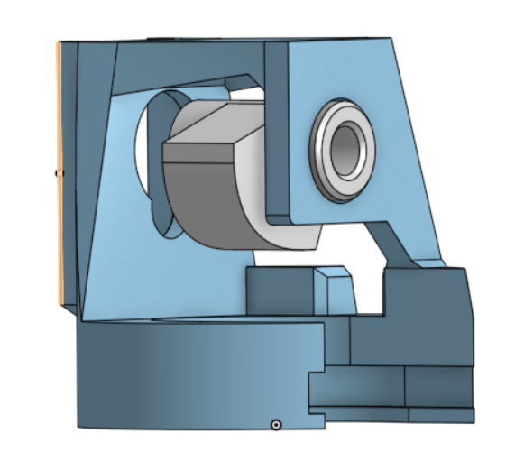

# Mechanism Overview: Servo-Driven Spray Actuation

This concept uses a servo motor and a 3D-printed linkage to convert rotational torque into a controlled spray action. The servo provides a precise turn moment that drives a cam or lever, which in turn presses a spray actuator or trigger. A return spring (or the servo's reverse motion) resets the mechanism after each actuation.

## Core Components
- Servo motor with adequate torque for the spray trigger force
- 3D-printed cam/lever and mounting bracket
- Spray actuator interface (e.g., a push rod or trigger pad)
- Return spring or elastic element (optional, for reset and preload)
- Fasteners and bearings/bushings as needed for smooth motion

## Mechanism Flow
1. The servo rotates to a target angle, generating torque.
2. The 3D-printed cam/lever converts rotation into linear or push motion.
3. The push motion presses the spray actuator to dispense.
4. The servo reverses (or the spring returns) to reset the linkage.

## Design Notes
- Use a cam profile or lever ratio that maximizes force near the end of travel.
- Align the actuator contact surface to avoid side loading on the spray nozzle.
- Limit servo travel to prevent over-pressing and damaging the actuator.
- Consider adding a mechanical stop to protect the mechanism.

## Calibration
- Start with small servo angles and increase until spray actuates reliably.
- Measure required trigger force to select servo torque.
- Tune dwell time at full press to control spray duration.
