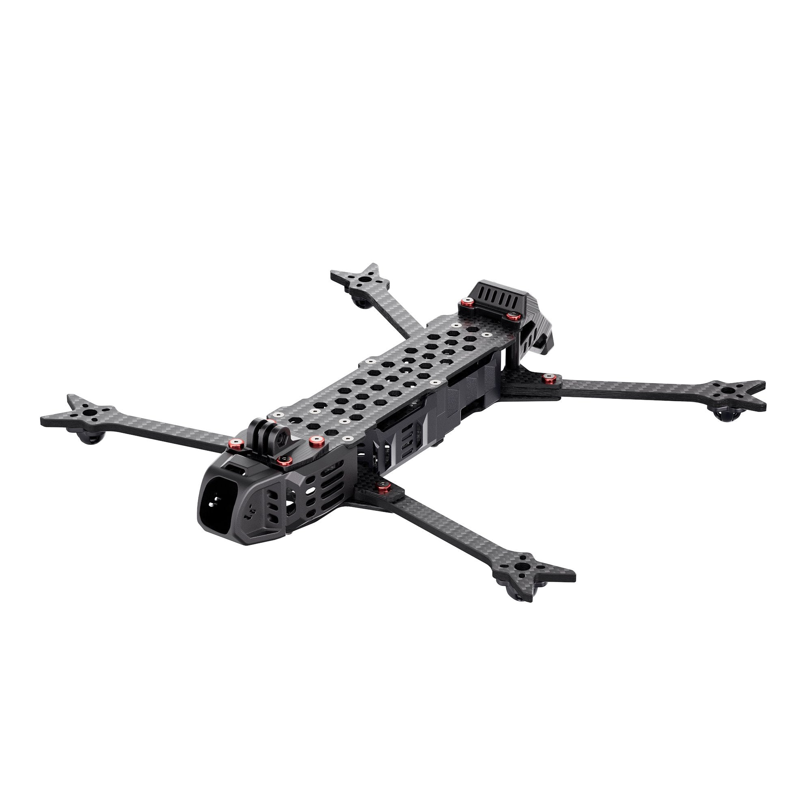
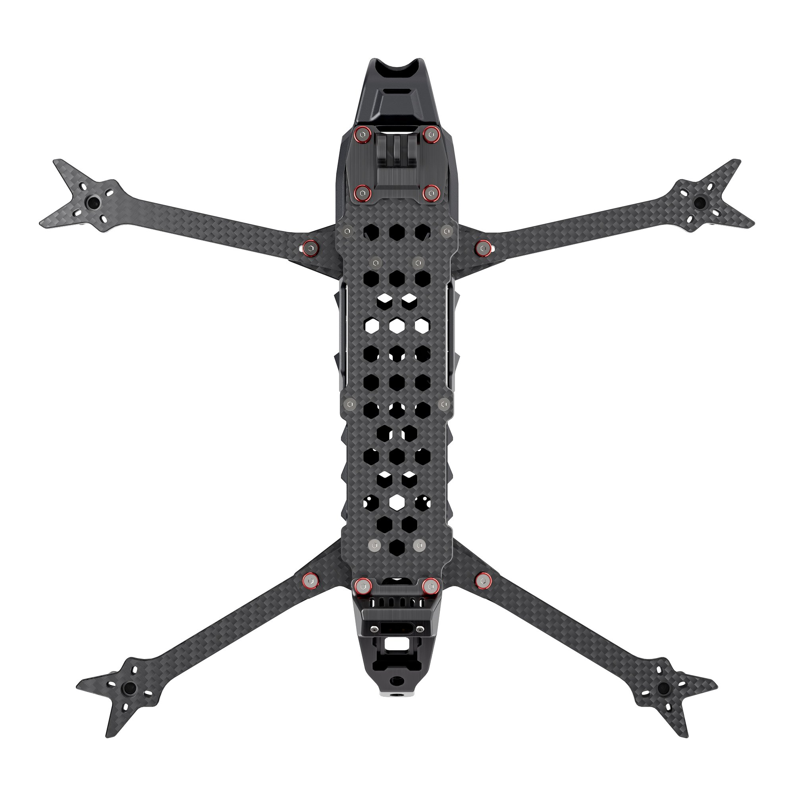

# Drone Frame for BBC — Crocodile Design

## Overview

**BBC** is the name of the drone-mountable painting component (airbrush + compressor + solenoid + servo mechanism). The frame documented here is the carrier drone platform on which BBC is installed.

For the drone carrying the BBC component, we selected a **crocodile-style frame** — an elongated body where the front of the frame extends well ahead of the front motors. This geometry was chosen for three reinforcing reasons:

1. **Positive aerodynamic body effects** — the elongated fuselage reduces turbulence and improves airframe stability compared to a compact X-frame.
2. **Better weight distribution** — payload (compressor, paint reservoir, solenoid) can be spread along the body length, keeping the centre of gravity close to the motor plane without ballast.
3. **Airbrush placement ahead of the front motors** — the extended nose positions the airbrush nozzle in clean, undisturbed air, far in front of the propeller wash. This gives consistent, even atomisation undisturbed by motor downwash.

---

## Open Source
https://www.printables.com/model/275006-aesir-ii/files

## Frame Reference Images

---

## Why Not a Standard X-Frame

| Property | X-frame | Crocodile frame |
|----------|---------|-----------------|
| Airbrush position | Between / behind motors | Ahead of front motors — clean air |
| Weight distribution | Centralised, limited | Distributed along body length |
| Payload mounting options | Limited to centre plate | Full body length available |
| Aerodynamic body effect | Minimal | Elongated fuselage acts as lifting body |

---

## Notes

- The airbrush must be mounted on the extended nose section, forward of the front motor plane, to avoid spray contamination from propeller wash.
- The elongated body makes it easier to balance the centre of gravity when the compressor and paint reservoir are mounted at different positions along the fuselage.
