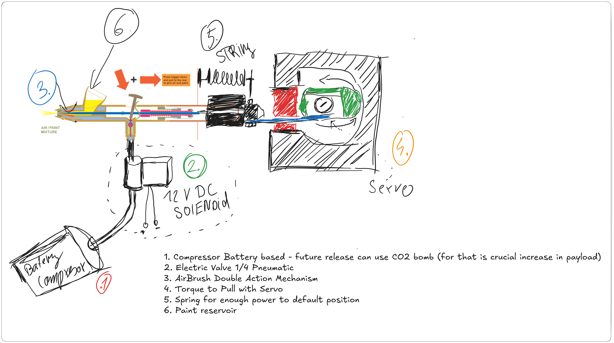
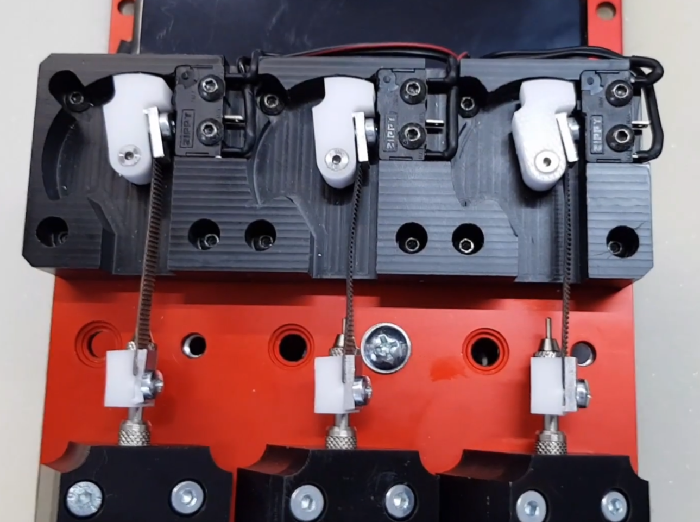

# BBC Spraying Mechanism — v0.2.0

Drone-mounted precision spraying system inspired by CNC airbrush setups. Enables autonomous spray painting from a drone platform with electrically controlled paint flow and air pressure.

---

## Overview

The system replicates how a CNC machine actuates an airbrush trigger: compressed air is gated by a solenoid valve, while a servo motor pulls the airbrush trigger needle rearward via a string linkage. A return spring resets the trigger to the default (closed) position when the servo releases tension.

---

## Components


*Component numbers in the diagram correspond to the table below.*

| # | Component | Description |
|---|-----------|-------------|
| 1 | **Battery Compressor** | Portable 12 V DC compressor provides compressed air. Future versions may replace this with a CO₂ bomb canister to reduce weight and increase payload capacity. |
| 2 | **12 V DC Solenoid Valve** | 1/4" pneumatic electric valve. Controls whether compressed air reaches the airbrush. Opens on signal, defaults closed. |
| 3 | **Airbrush — Double Action** | Double-action airbrush: pressing the trigger down admits air; pulling the trigger rearward meters in paint. Both axes are independently actuated in this system. |
| 4 | **Servo Motor + Torque-to-Pull Mechanism** | Servo rotational output is converted to linear pull via a string/cable linkage attached to the airbrush trigger needle. Controls paint flow amount. See diagram below. |
| 5 | **Return Spring** | Keeps the trigger needle in the fully-forward (no-paint) default position. Provides consistent return force when the servo releases tension. |
| 6 | **Paint Reservoir** | Gravity-feed cup mounted on top of the airbrush body. |

---

## Servo Pull Mechanism


*The servo rotational motion is transferred into a linear pull on the airbrush trigger needle via a string/cable linkage.*

---

## How It Works

```
Battery Compressor ──► Solenoid Valve ──► Airbrush (air channel)
                                              │
                              Servo ──► String linkage ──► Trigger needle (paint channel)
                                              │
                                         Return Spring (default: closed)
```

1. **Air control** — The solenoid valve opens to let compressed air flow into the airbrush. This is the on/off gate for the entire spray.
2. **Paint control** — The servo motor rotates, pulling a string that drags the airbrush trigger needle rearward. The further back the needle is pulled, the more paint is metered into the airstream.
3. **Spray output** — Air and paint mix at the airbrush nozzle and are atomised as a fine spray.
4. **Reset** — When the servo releases tension, the return spring pushes the trigger needle back to the forward position, stopping paint flow. The solenoid closes to cut air.

---

## Control Logic

| Action | Solenoid | Servo position |
|--------|----------|----------------|
| Idle / off | Closed | 0° (spring return) |
| Air only (purge) | Open | 0° |
| Spray (light) | Open | low angle |
| Spray (full) | Open | max pull angle |
| Emergency stop | Closed | 0° |

---

## Inspiration

- [CNC Airbrush Painting Machine](https://www.youtube.com/watch?v=PIVVX-pQsZs)
- [Automated Airbrush with Solenoid](https://www.youtube.com/watch?v=VYiqNWHD3ZI)
- [Servo-Controlled Airbrush Trigger](https://www.youtube.com/watch?v=nxY5MF2WPrg)

---

## Future Improvements

- **CO₂ canister** — Replace the battery compressor with a lightweight CO₂ bomb. Critical dependency: increasing drone payload capacity first.
- **Flow calibration** — Map servo angle to actual paint flow rate for repeatable coverage.
- **Pressure regulator** — Add inline pressure regulator between compressor/CO₂ and solenoid for consistent atomisation regardless of tank pressure.
- **Nozzle size selection** — Different nozzle sizes for different spray widths / materials.
